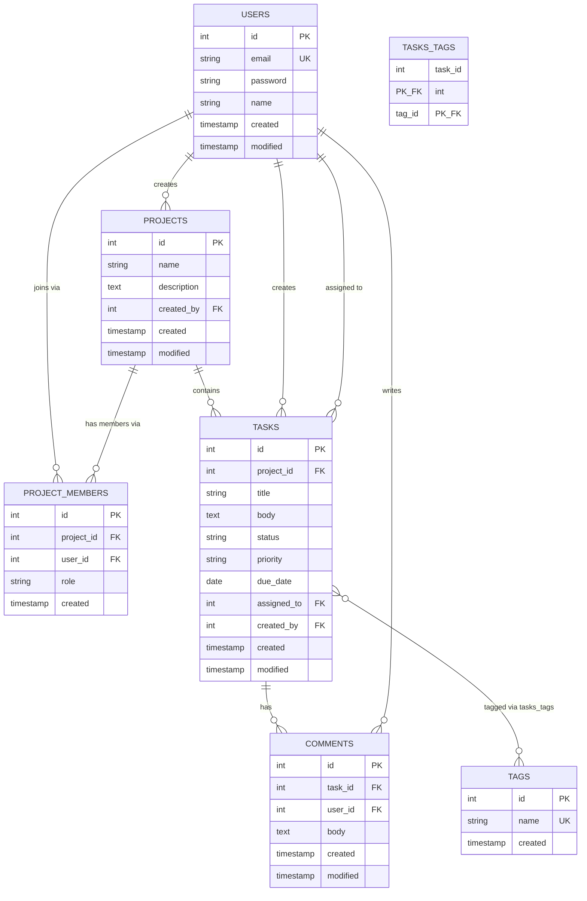

# DESIGN.md — KanbanCake 設計書

社内向け簡易プロジェクト・タスク管理ツールの設計書。データモデル、画面構成、認可ルールを記述。

---

## 1. アーキテクチャ概要

CakePHP 5.x 標準のレイヤー構成。

| レイヤー | 配置 | 役割 |
|---------|------|------|
| Controller | `src/Controller/` | HTTP リクエスト処理、ビュー組み立て |
| Model (Table) | `src/Model/Table/` | DB アクセス、ORM、関連定義 |
| Model (Entity) | `src/Model/Entity/` | 1レコードの振る舞い、計算プロパティ |
| Policy | `src/Policy/` | 認可ルール |
| Service | `src/Service/` | ビジネスロジック（必要な箇所で使用） |
| Templates | `templates/` | ビュー（PHP テンプレート） |

認証：`cakephp/authentication`（セッションベース、PasswordIdentifier）
認可：`cakephp/authorization`（Policy クラスによる宣言的認可）

---

## 2. データモデル

### 2.1 ER 図

### 2.2 テーブル定義

#### users
| カラム | 型 | 制約 | 備考 |
|--------|----|------|------|
| id | integer | PK auto-increment | |
| email | varchar(255) | UNIQUE NOT NULL | ログインID |
| password | varchar(255) | NOT NULL | DefaultPasswordHasher でハッシュ |
| name | varchar(100) | NOT NULL | 表示名 |
| created | timestamp | NOT NULL | |
| modified | timestamp | NOT NULL | |

#### projects
| カラム | 型 | 制約 | 備考 |
|--------|----|------|------|
| id | integer | PK auto-increment | |
| name | varchar(255) | NOT NULL | |
| description | text | | 任意 |
| created_by | integer | FK→users.id NOT NULL | 作成者 |
| created | timestamp | NOT NULL | |
| modified | timestamp | NOT NULL | |

#### project_members
| カラム | 型 | 制約 | 備考 |
|--------|----|------|------|
| id | integer | PK auto-increment | |
| project_id | integer | FK→projects.id NOT NULL | |
| user_id | integer | FK→users.id NOT NULL | |
| role | varchar(20) | NOT NULL DEFAULT 'member' | 'owner' / 'member' |
| created | timestamp | NOT NULL | |
| | | UNIQUE(project_id, user_id) | 同一ユーザの重複参加防止 |

#### tasks
| カラム | 型 | 制約 | 備考 |
|--------|----|------|------|
| id | integer | PK auto-increment | |
| project_id | integer | FK→projects.id NOT NULL | |
| title | varchar(255) | NOT NULL | |
| body | text | | 任意 |
| status | varchar(20) | NOT NULL DEFAULT 'todo' | todo / doing / done |
| priority | varchar(20) | DEFAULT 'medium' | low / medium / high |
| due_date | date | | 任意 |
| assigned_to | integer | FK→users.id | 任意、メンバーのみ |
| created_by | integer | FK→users.id NOT NULL | |
| created | timestamp | NOT NULL | |
| modified | timestamp | NOT NULL | |

#### comments
| カラム | 型 | 制約 | 備考 |
|--------|----|------|------|
| id | integer | PK auto-increment | |
| task_id | integer | FK→tasks.id NOT NULL | |
| user_id | integer | FK→users.id NOT NULL | 投稿者 |
| body | text | NOT NULL | |
| created | timestamp | NOT NULL | |
| modified | timestamp | NOT NULL | |

#### tags
| カラム | 型 | 制約 | 備考 |
|--------|----|------|------|
| id | integer | PK auto-increment | |
| name | varchar(100) | UNIQUE NOT NULL | グローバル一意 |
| created | timestamp | NOT NULL | |

#### tasks_tags
| カラム | 型 | 制約 | 備考 |
|--------|----|------|------|
| task_id | integer | FK→tasks.id | 複合PK |
| tag_id | integer | FK→tags.id | 複合PK |

---

## 3. 画面・ルーティング

### 3.1 ルーティング一覧

| HTTP | URL | Controller::action | 認証 | 説明 |
|------|-----|-------------------|------|------|
| GET | / | Pages::display | 不要 | トップ |
| GET / POST | /users/register | Users::register | 不要 | 新規登録 |
| GET / POST | /users/login | Users::login | 不要 | ログイン |
| POST | /users/logout | Users::logout | 要 | ログアウト |
| GET | /dashboard | Dashboard::index | 要 | ダッシュボード |
| GET | /projects | Projects::index | 要 | 参加プロジェクト一覧 |
| GET / POST | /projects/add | Projects::add | 要 | プロジェクト新規作成 |
| GET | /projects/{id} | Projects::view | 要・メンバー | プロジェクト詳細 |
| GET / POST | /projects/{id}/edit | Projects::edit | 要・owner | プロジェクト編集 |
| POST | /projects/{id}/delete | Projects::delete | 要・owner | プロジェクト削除 |
| POST | /projects/{id}/members | Projects::addMember | 要・owner | メンバー追加 |
| POST | /projects/{id}/members/{userId}/delete | Projects::removeMember | 要・owner | メンバー削除 |
| GET / POST | /projects/{id}/tasks/add | Tasks::add | 要・メンバー | タスク作成 |
| GET | /tasks/{id} | Tasks::view | 要・メンバー | タスク詳細 |
| GET / POST | /tasks/{id}/edit | Tasks::edit | 要・メンバー | タスク編集 |
| POST | /tasks/{id}/delete | Tasks::delete | 要・メンバー | タスク削除 |
| POST | /tasks/{id}/comments | Comments::add | 要・メンバー | コメント追加 |
| POST | /comments/{id}/delete | Comments::delete | 要・本人 | コメント削除 |
| GET | /search | Search::index | 要 | タスク検索 |

### 3.2 主要画面

| 画面 | テンプレート | 概要 |
|------|------------|------|
| ダッシュボード | `templates/Dashboard/index.php` | 自分担当・期限近・参加プロジェクト |
| プロジェクト一覧 | `templates/Projects/index.php` | 参加中のプロジェクト |
| プロジェクト詳細 | `templates/Projects/view.php` | メンバー・タスク一覧・統計 |
| タスク詳細 | `templates/Tasks/view.php` | タスク情報・コメント・タグ |
| 検索結果 | `templates/Search/index.php` | キーワード検索結果 |

---

## 4. 認可ルール

| 対象 | アクション | 許可される利用者 |
|------|-----------|----------------|
| プロジェクト | view | プロジェクトメンバー |
| プロジェクト | edit / delete | owner |
| プロジェクト | addMember / removeMember | owner |
| タスク | view | プロジェクトメンバー |
| タスク | add / edit / delete | プロジェクトメンバー |
| コメント | add | プロジェクトメンバー |
| コメント | delete | 投稿者本人 |

実装は `src/Policy/` 配下のポリシークラスで宣言。
ミドルウェアは `src/Application.php` で `AuthorizationMiddleware` を有効化。

---

## 5. 認証フロー

1. 未ログインユーザが保護ルートにアクセス
2. `AuthenticationMiddleware` がリクエストを捕捉、未認証なら `/users/login` にリダイレクト
3. `/users/login` で email + password を送信
4. `PasswordIdentifier` が `users` テーブルを照合
5. 成功時、セッションに identity を保存 → 元のURLにリダイレクト
6. 以降のリクエストはセッション Cookie で認証

ログアウトは `/users/logout` (POST) で `Authentication::logout()` を呼びセッション破棄。

---

## 6. シードデータ

`bin/cake migrations seed` 実行で以下を投入：

| テーブル | 件数 |
|---------|------|
| users | 5 |
| projects | 3 |
| project_members | 各プロジェクト 2〜4 件 |
| tasks | プロジェクトあたり 8件（各プロジェクトに due_date=today を1件含む） |
| comments | タスクの一部に 0〜5 件 |
| tags | 10種程度 |
| tasks_tags | タスクにランダム付与 |

詳細は `config/Seeds/` 配下の各シードクラス参照。

---

## 7. テスト

`tests/TestCase/` 配下に PHPUnit のテスト。
全実行：`docker-compose exec app vendor/bin/phpunit`

主要なテスト対象：
- 認証フロー（ログイン・ログアウト）
- TasksTable の関連・バリデーション

未カバー領域もある。新規コードには必要に応じてテストを追加すること。
